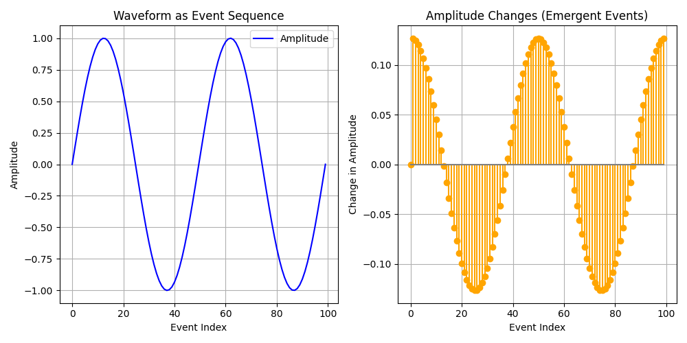
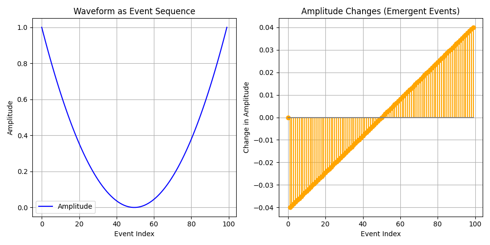
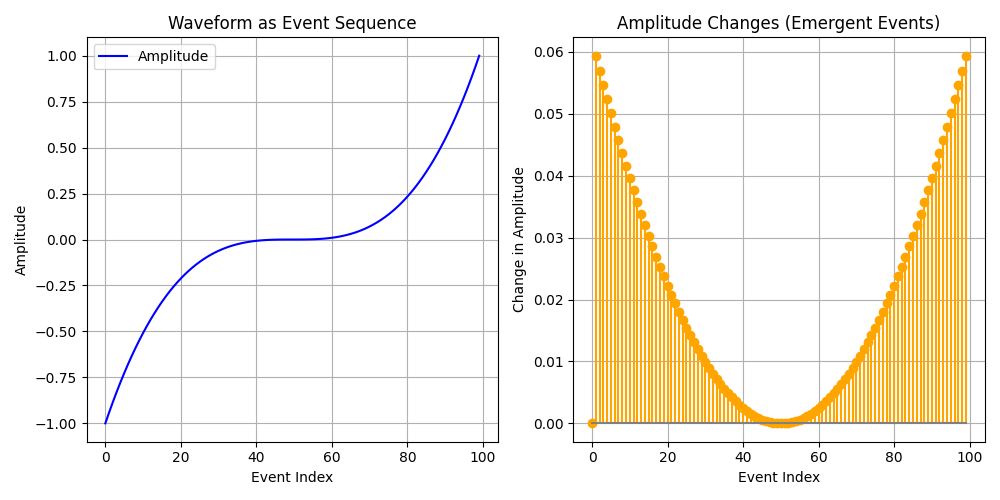

# The One: The Whole is More Than the Sum of the Parts

## Dor

"Time, he learned, was not to be measured in hours or minutes, or even seconds. Time was measured in moments. The time keeper didn’t just count the seconds, he understood their significance, how each moment could shape a life, a destiny."

"the true beauty of time lies in its impermanence"

Albom, Mitch. The Time Keeper. New York: Hyperion, 2012.

