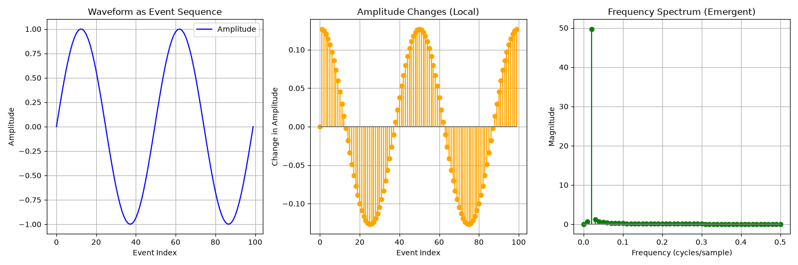
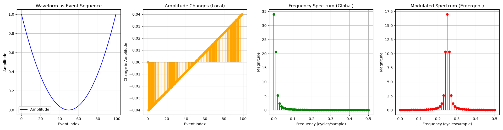
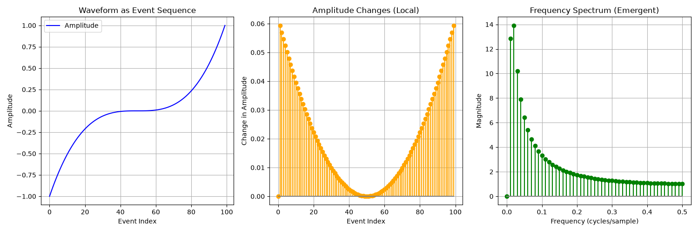

# The One

## Moments, Not Minutes

"Time, he learned, was not to be measured in hours or minutes, or even seconds. Time was measured in moments. The time keeper didn’t just count the seconds, he understood their significance, how each moment could shape a life, a destiny."

"the true beauty of time lies in its impermanence"

Albom, Mitch. *The Time Keeper*. New York: Hyperion, 2012.

---

A small wave generator that treats a signal as a discrete sequence of events (moments) rather than continuous time. Four panels show different ways of relating those moments to one another.

## Usage

Requires `numpy` and `matplotlib`.

```bash
python3 TheOne.py
```

Pick a function (1–13) at the prompt. A four-panel plot opens.

## The four panels

**1. Waveform as Event Sequence**  
The raw signal, indexed by event (sample) number instead of clock time.

**2. Amplitude Changes (Local)**  
The discrete difference between neighboring moments. Depends on only two consecutive samples and is fully invertible by cumulative sum — a re-expression of the same sequence, not new information.

$$y[i] - y[i-1]$$

**3. Frequency Spectrum (Global, linear)**  
Magnitude of the discrete Fourier transform. Every bin is a weighted sum over the entire sequence, so it needs every moment, yet the operation remains linear: each term can be computed independently.

$$X[k] = \sum_{n=0}^{N-1} x[n]\, e^{-i 2\pi k n / N}$$

**4. Modulated Spectrum (Nonlinear interaction)**  
The original sequence multiplied by a fixed carrier tone (one-quarter of the sampling rate). Multiplication produces sum and difference frequencies that appear in neither the original spectrum nor the carrier’s spectrum alone. For a pure tone at frequency \(f_0\) and a carrier at \(f_c\):

$$\sin(2\pi f_0 n)\cos(2\pi f_c n) = \frac{1}{2}\sin\big(2\pi (f_0+f_c) n\big) + \frac{1}{2}\sin\big(2\pi (f_0-f_c) n\big)$$

## Takeaway

- **Local** — relation between neighboring moments only.
- **Global (linear)** — relation that involves every moment, but only through addition.
- **Nonlinear** — two sequences interact by multiplication; the result contains structure that belongs to neither sequence by itself.

The point is not metaphysics. It is simply to make visible three different kinds of dependence that can exist among a sequence of moments.



